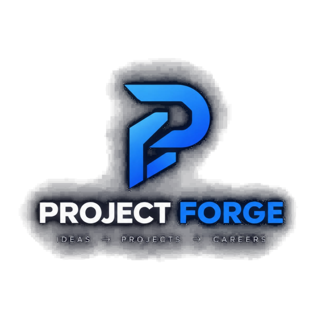

<p align="center">
  
</p>

# ProjectsForge — Hackathon MVP

> From project ideas to career-ready skills.

**🟢 Live demo: https://projectsforge-nu.vercel.app** (Gemini cloud mode) — locally the same app runs on Ollama with no API key (see Configuration).

A focused hackathon prototype: **student login → profile → personalized project recommendation → skill gap → weekly block-diagram roadmap with vetted resources → feedback straight to the team's WhatsApp → mark project complete → Communication Skills (self-introduction + interview guide)**. One strong working journey, powered by real AI — no canned demo data, no fallback mode.

**What's in this build**

- 🎓 **Student login** — real accounts on **Firebase Authentication** (email + password, sign in from any device); no database of our own.
- 🔑 **Forgot password** — Google emails a reset link to any address (150/day on the free plan, no SMTP of ours); the link opens our own in-app *set a new password* screen. Loud, honest errors when Firebase is unreachable or unconfigured.
- ☁️ **Cloud records (Firestore backbone)** — profile, analysis, self-introduction and completion records live under your account: sign in on another device and everything is there. Records that older versions saved only in this browser are imported into the cloud once, automatically.
- 👑 **Founder dashboard** — the founder account gets an *All students* view at `/founder`: every student's profile, latest match score, run/introduction counters and completion records. The gate is the verified email on the server, and the database runs locked — the browser never talks to Firestore directly.
- 🧠 **Real AI analysis** — recommendation, skill gap and roadmap from Gemini (prod) or Ollama (local); loud 502/503/504 on failure.
- 🧱 **Weekly block diagrams** — every week renders as a `Learn → Build → Deliver` block flow, and after all weeks a **final block diagram** shows the whole journey into the final deliverable.
- 📚 **Vetted resources in every roadmap week** — hand-picked official docs/courses matched to that week's topics, and **a video in every week**: direct links for major topics (freeCodeCamp/Dave Gray, oEmbed-verified at curation time) plus a YouTube search for the rest — marked with ▶. Search fallbacks are valid by construction, so no AI-hallucinated links exist.
- 📝 **Profile background** — hobbies, schooling and college are asked alongside branch/year/skills (all optional), feeding both the analysis and the self-introduction.
- 🗣️ **AI self-introduction** — auto-generated the first time the *Self-intro* tab is opened: first person, 90–140 words, grounded strictly in the profile (regenerated automatically when the profile changes; Copy + Regenerate; loud errors, zero canned text).
- 🔒 **Communication Skills section** — locked until the student **marks a project complete** on the roadmap. Unlocked, it holds the self-introduction, the completed-project record (stack, weeks, skills covered, why-matched, final deliverable) and a curated interview guide (introduce yourself, explain your project, technical questions, STAR method) with verified links.
- 💬 **WhatsApp feedback** — rate + comment + suggestions on the result page (and a one-click check-in under each week) open a prefilled WhatsApp message to the team; email fallback always available.
- 📧 **Footer contact** — `projectforgestartup@gmail.com` on every page, plus suggestions welcome.

## Stack

- **Next.js 16** (App Router, Turbopack) + TypeScript + Tailwind CSS v4
- **Firebase Authentication** — cloud email/password accounts + Google-sent password-reset links (Firebase Auth emulator for local dev and E2E)
- **Cloud Firestore** — the Phase 2 records backbone, accessed only through server routes (Admin SDK, verified ID tokens); production-mode rules keep the client SDK out entirely
- **Dual-mode AI layer** — local **Ollama** (`phi4-gpu` by default) or cloud **Gemini** (`gemini-3.8-flash`), selected by env, both with **JSON-schema-constrained output**
- **zod** validation on every model reply, with one corrective retry
- **Curated dataset** of 16 project records that grounds the model (it may only recommend ids from the shortlist)

## Prerequisites

1. [Ollama](https://ollama.com) installed and running (`ollama serve`)
2. A model pulled: `ollama pull phi4-gpu` (or `qwen3:4b`, `phi4-mini`…)
3. Node.js 20.9+
4. *(Optional, cloud mode)* a [Gemini API key](https://aistudio.google.com/apikey)

## Run

```bash
npm install
npm run dev
```

Open http://localhost:3000 — the header badge shows the **real** engine status.

### Configuration (`.env.local`)

| Variable            | Default                   | Purpose                                       |
| ------------------- | ------------------------- | --------------------------------------------- |
| `OLLAMA_HOST`       | `http://127.0.0.1:11434`  | Ollama server URL                             |
| `OLLAMA_MODEL`      | `phi4-gpu`                | Local model used when Ollama is active        |
| `OLLAMA_TIMEOUT_MS` | `180000`                  | Per-request model timeout (both providers)    |
| `GEMINI_API_KEY`    | *(unset)*                 | **Enables cloud mode** — Gemini replaces Ollama |
| `GEMINI_MODEL`      | `gemini-3.8-flash`        | Gemini model name                             |
| `AI_PROVIDER`       | *(auto)*                  | Force `ollama` or `gemini` regardless of key  |
| `NEXT_PUBLIC_WHATSAPP_NUMBER` | *(unset)*      | Team WhatsApp number (digits, country code) for feedback delivery — until set, feedback falls back to email with a visible warning |
| `NEXT_PUBLIC_FIREBASE_*` | *(6 values)*        | Firebase web-app config for Authentication (`API_KEY`, `AUTH_DOMAIN`, `PROJECT_ID`, `STORAGE_BUCKET`, `MESSAGING_SENDER_ID`, `APP_ID`) — public by design |
| `FIREBASE_SERVICE_ACCOUNT_KEY` | *(unset)*    | **Phase 2 backbone** — the service-account JSON (whole file, one line) that lets server routes read/write Firestore; unset = every records call fails loudly with a 503 |
| `FIRESTORE_DATABASE_ID` | `(default)`          | Firestore database id chosen at creation — only set this if the console forced a named database (e.g. `projectsforge`) |
| `NEXT_PUBLIC_FOUNDER_EMAIL` | `projectforgestartup@gmail.com` | Founder dashboard gate (client hides the link; the server enforces it) |

**Provider resolution:** `AI_PROVIDER` wins → else `GEMINI_API_KEY` set means
Gemini → else local Ollama. Same contract both ways: zod + business-rule retry,
and loud 502/503/504 on failure — never canned data. For a hosted deploy
(e.g. Vercel) set `GEMINI_API_KEY`; locally leave it unset to keep the
"local LLM, no API key" story.

## API

### `POST /api/analyze`

```jsonc
{
  "branch": "CSE",
  "year": "1st year",
  "skills": ["Python", "HTML/CSS"],
  "interests": ["AI / ML", "Web Development"],
  "careerGoal": "Placement / Job",
  "availableWeeks": 4
}
```

**200** → `{ profile, analysis, model, candidateCount, elapsedMs, persisted }`

`analysis` contains `primary`, `alternatives` (2–3), `skillGap`, `roadmap` (exactly `availableWeeks` entries), `nextStep`, `risks`, `assumptions`.

All three student routes authenticate with `Authorization: Bearer <Firebase ID token>`; the server verifies the token's RS256 signature against Google's public JWKS (`node:crypto` — deliberately not `firebase-admin/auth`, whose `jwks-rsa → jose` ESM chain crashes Vercel lambdas) and stores the run under `students/{uid}` (`persisted:false` + a server log entry when the Firestore save fails).

**Failure modes (deliberately loud — there is no canned fallback):**

| Status | Meaning                                                                                     |
| ------ | ------------------------------------------------------------------------------------------- |
| 400    | Invalid profile (zod issues returned)                                                       |
| 401    | Missing/expired session — the request carried no valid ID token                             |
| 502    | Model returned invalid JSON/structure twice                                                 |
| 503    | Engine unreachable/rejected — Ollama down, Gemini key rejected, or upstream 5xx after retries |
| 504    | Model timed out                                                                             |

### `GET /api/records`

The signed-in student's cloud records in one round trip:
`{ profile, intro, completions, run, runCount, introCount }` — this is what
hydrates `/result` and `/communication` on a fresh device.

### `POST /api/records`

`{ action: "complete", record }` marks a project done (idempotent, inside a
transaction) or `{ action: "migrate", completions, intro }` performs the
one-time import of Phase-1 localStorage records — merge-by-id, never
overwriting newer cloud data. Returns `{ completions }`.

### `GET /api/founder`

The all-students dashboard feed (founder account only — verified ID token
email). Returns `{ students: [...] }` with each student's profile, latest
analysis, counters and completion records.

### `GET /api/health`

Real liveness of the active engine: `{ ok, provider, model, region, modelPresent }`
(`provider` is `ollama` or `gemini`; `region` is the Vercel function region or `local`).

### `GET /api/pingai` *(diagnostics)*

Probes the active Gemini model twice from the server's own egress — one plain
call, one JSON-schema-constrained call — and reports status + latency for each.
Useful for distinguishing "engine down" from "structured-output mode rejected".

## How the "zero fallback" AI layer works

```
profile ──► deterministic candidate ranking (top 8 of 16 records)
                 │
                 ▼
        prompt + zod-derived JSON schema
                 │
                 ▼
        Ollama /api/chat (format: <schema>)        ← constrained decoding
        Gemini  generateContent (responseSchema)   ← structured output
                 │   (if upstream 5xx's structured mode — e.g. from
                 │    datacenter IPs — retry is prompt-enforced JSON;
                 │    the zod gate below is identical either way)
                 │
                 ▼
        zod parse + business rules ──fail──► corrective retry (once)
                 │                              │
               pass                          fail
                 │                              │
                 ▼                              ▼
              200 OK                    502 with precise reason
```

- The JSON schema sent to the engine is **generated from the zod schema** (`z.toJSONSchema`), so the contract has a single source of truth.
- Business rules (ids must exist in the dataset, unique alternatives, roadmap length, non-empty skill gap) run after zod and also trigger retries.
- If the engine is down, the UI shows the exact error — it never silently swaps in fake results.

## Demo script (per the roadmap)

1. **Landing** → logo, value proposition + live engine badge.
2. **Login** → create a student account (email + password, backed by Firebase Auth).
3. **Profile** → enter a 1st-year CSE-IoT student, 2–3 skills, 4 weeks.
4. **Recommendation** → primary project + match score + *why this project* + 2–3 alternatives.
5. **Skill Gap** → existing skills (echoed from the form) vs. skills to learn with priorities.
6. **Roadmap** → weekly **block diagram** (`Learn → Build → Deliver`) with vetted resources per week, then the **final block diagram** (phases → final deliverable), plus honest risks & assumptions.
7. **Feedback** → star rating + comments + suggestions → prefilled WhatsApp message to the team (email fallback). Each week also has a one-click "week done" check-in.
8. **Self-intro tab** → the AI writes your first-person introduction from the profile (name → branch/year → background → skills → goal → hobbies); Copy / Regenerate.
9. **Communication Skills** → visiting it before finishing a project shows the *locked* card; after clicking **Mark project complete** on the roadmap it opens with the self-intro, the completed-project record and the interview guide.
10. **Video in every week** → each week's resources carry at least one ▶ video link alongside the docs.
11. **Fresh device** → sign in from a different browser: the roadmap, the self-introduction and the completion records all load from the cloud (the Communication section unlocks without touching the first browser).
12. **Founder dashboard** → sign in as the founder → the *Founder* chip in the header → every student's profile, latest match score and completed projects in one view.

**Personalization proof:** change one field (e.g. 4 → 12 weeks, or add "Arduino") and re-run — the recommendation, skill gap and roadmap visibly change.

**Branding:** the original PROJECT FORGE logo (`scripts/logo-source.png`) feeds the whole brand pipeline — `public/logo.png` (full lockup, README + hero + login), `public/logo-mark.png` (square mark for headers/footer), `src/app/icon.png` + `apple-icon.png` (browser/home-screen icons), `src/app/opengraph-image.png` (link previews); regenerate all with `node scripts/make-brand.mjs`.

## Team split

| You (Product/Frontend/Pitch) | Teammate (AI/Backend) |
| ---------------------------- | --------------------- |
| Screens, flow, story          | `src/lib/ollama.ts`, `src/lib/prompt.ts` |
| Demo choreography            | Prompt rules, dataset tuning in `src/lib/projects.ts` |
| Judge Q&A                    | Failure modes (502/503/504) explanation |

## Scripts

```bash
npm run dev      # dev server (Turbopack)
npm run build    # production build (type-checked)
npm run start    # serve the production build
npm run lint     # eslint
```
